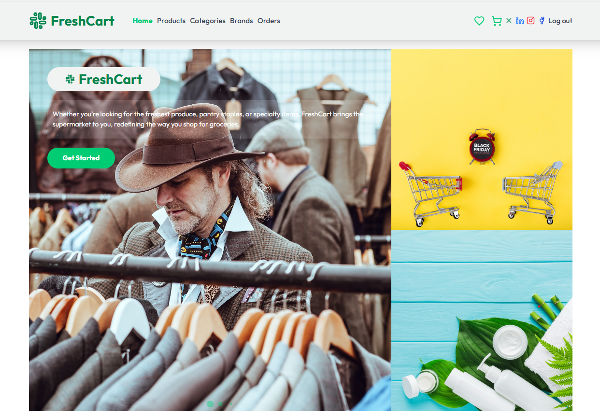
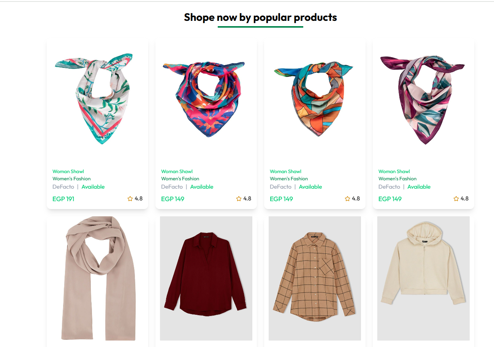
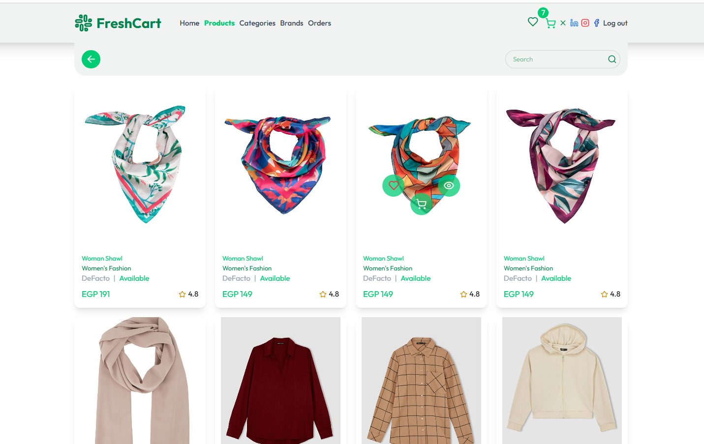
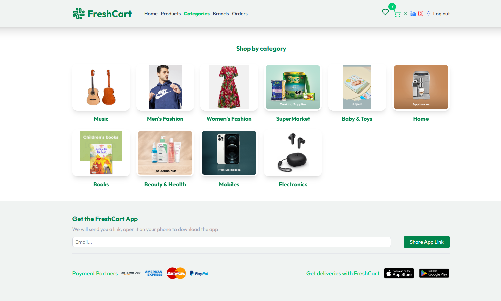
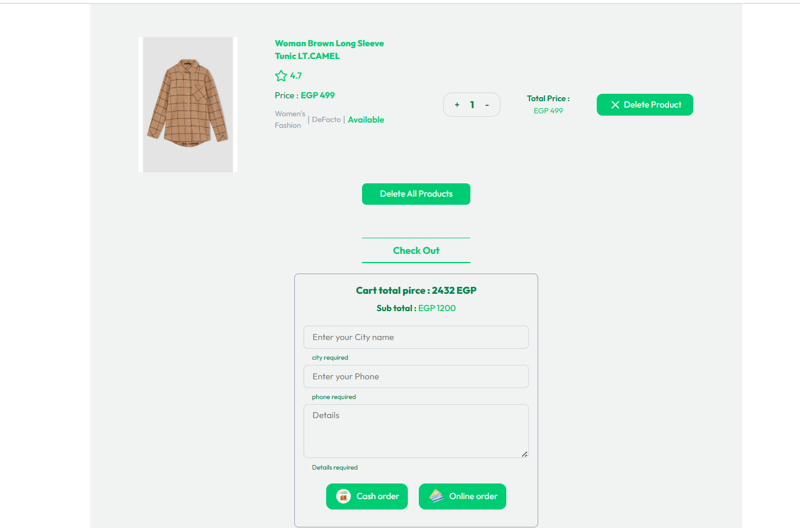

## Fresh Cart | E-Commerce-App

A comprehensive React e-commerce platform featuring dynamic product listings, categories, brands, cart, wishlist , secure cash/online payments, order tracking, and related product suggestions. Fully responsive.

##### 🌐 visit the website: [Fresh Cart Live Demo](https://e-commerce-app-nine-rho.vercel.app/)
### 🚀 Overview of project pages :
##### 🏠 Home Page :
The main landing page showcasing featured products and latest offers. It provides quick access to major store categories, ensuring an easy and engaging Browse experience.

#### 🏠 Another Section in Home Page :
This is the section of products , You can add products to cart , wishlist , and view the detailes of specific product.

##### Products Page :
Displays all available products with advanced filtering and search options, helping users quickly find what they're looking for.

##### Categories Page :
A page to display all the categories. You can get all the products that are available in a specific category.

##### Check out Section : 
In this section you can place an order and there is a cash or online payment option if you want.

## ✨ Key Features

* **User Authentication:** Secure user login and registration, providing a personalized experience.
* **Product Browse:** Easily navigate through various product categories and brands with intuitive filtering options.
* **Search Functionality:** Quickly find desired products using a robust and efficient search bar.
* **Shopping Cart Management:** Add, remove, and update quantities of items in the cart, with real-time total calculation.
* **Wishlist Functionality:** Save favorite products for later purchase, enhancing personalized shopping.
* **Detailed Product Views:** Access comprehensive information, multiple high-resolution images, pricing, and customer reviews for each product.
* **Order Management:** Track the status of current and past orders, with detailed order history.
* **Responsive Design:** Optimized for seamless viewing and interaction across various devices, including desktops, tablets, and mobile phones.

## 💻 Technologies Used

This project was developed using a modern stack of technologies to ensure optimal performance, scalability, and an excellent user experience:

### Frontend Technologies

 
**HTML5:** The core markup language for structuring content on the web, providing the foundation for all web pages.

 
**CSS3:** Used for styling the web pages, controlling layout, colors, fonts, and overall visual presentation.

**JavaScript:** A versatile programming language essential for creating interactive and dynamic content on websites.

 
**Tailwind CSS:** A utility-first CSS framework for rapidly building custom designs directly in your HTML markup, offering highly customizable styling.

 
**React.js:** A powerful JavaScript library for building user interfaces, enabling the creation of complex and interactive UIs with a component-based approach.

### Key React Libraries & Concepts

 
**Lucide React:** A beautiful and consistent icon library for React, providing a wide range of customizable SVG icons to enhance UI aesthetics.

 
**Formik:** A popular library for building and managing forms in React, simplifying form state management, validation, and submission.

 
**Yup:** A schema builder for value parsing and validation, often used with Formik to define strong validation rules for form data.

 
**Animate.css:** A collection of ready-to-use, cross-browser animations for use in your web projects, adding engaging visual effects.

 
**Context API:** A built-in React feature for state management, enabling data to be shared across the entire application's component tree without prop drilling.

### React Hooks

 
`useState` Hook:** A fundamental React Hook that allows functional components to manage and update their state.

 
`useEffect` Hook:** Used for performing side effects in functional components, such as data fetching, subscriptions, or manually changing the DOM.

 
`useParams` Hook:** A React Router Hook that allows access to URL parameters.
## 🌐 API Integration

This project leverages a custom e-commerce API to provide dynamic product data, user authentication, and comprehensive shopping cart management, ensuring a robust and interactive user experience.

* **E-commerce Backend API:** A dedicated RESTful API serving as the backend for the e-commerce functionalities, handling product listings, user management, order processing, and more.
    * **Purpose in Project:** Used to fetch comprehensive product listings, display detailed product information, manage user authentication (login/registration), handle shopping cart operations (add/remove items), and process order simulations.
    * **Base URL:** `https://ecommerce.routemisr.com`
    * **Documentation:** [E-commerce Backend API Documentation](https://anas-adel267.postman.co/workspace/452cdd52-cd62-4829-8166-b2f62c8afb2e/documentation/44326369-fdb0c61e-a65d-4388-93b3-b8980ed1d362)

## 📧 Contact
Feel free to connect with me!
* **Anas Adel**
* **GitHub:** [Anas26772001](https://github.com/Anas26772001)
---

