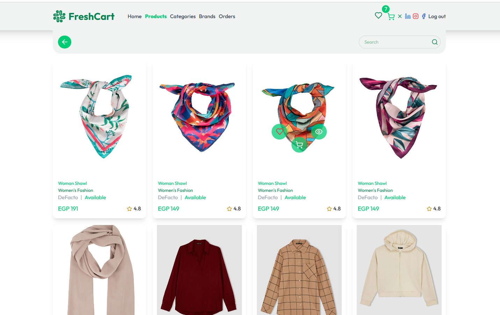
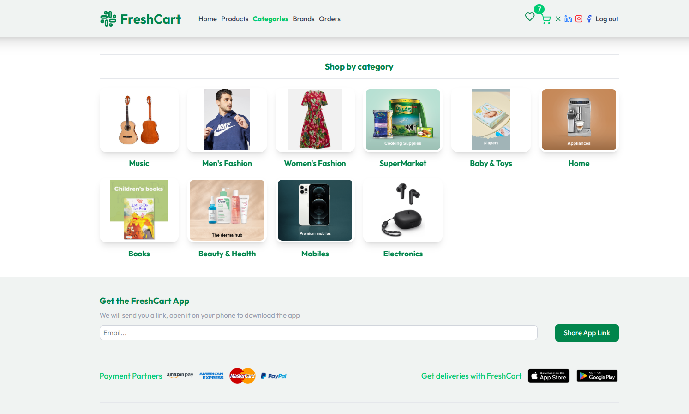
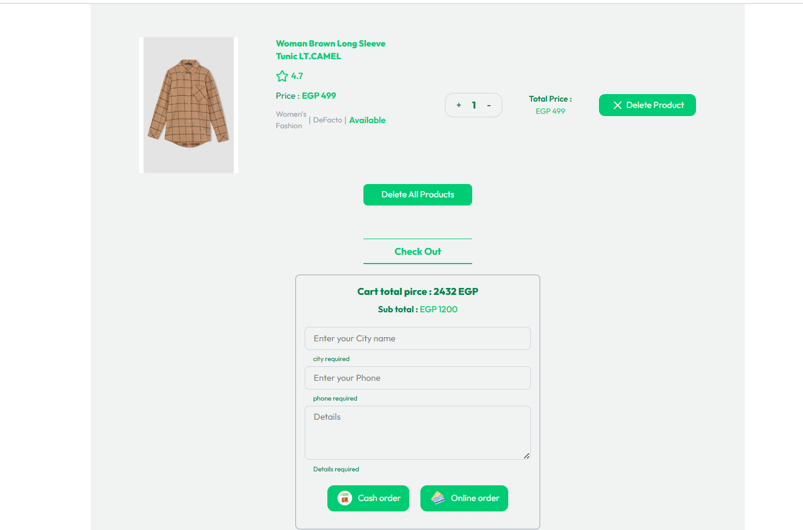

## Fresh Cart | E-Commerce-App

A comprehensive React e-commerce platform featuring dynamic product listings, categories, brands, cart, wishlist , secure cash/online payments, order tracking, and related product suggestions. Fully responsive.

##### 🌐 visit the website: [Fresh Cart Live Demo](https://e-commerce-app-nine-rho.vercel.app/)
### 🚀 Overview of project pages :
##### 🏠 Home Page :
This is the upper section of the page that contains the header and inside it the navbar, then a section dividing it, and the left part contains a swiper consisting of images and the right part contains two images.

#### 🏠 Another Section in Home Page :
This is the section of products , You can add products to cart , wishlist , and view the detailes of specific product.

##### Products Page :
On this page you can search for specific products and if they match, the products will be displayed.

##### Categories Page :
A page to display all the categories. You can get all the products that are available in a specific category.

##### Check out Section : 
In this section you can place an order and there is a cash or online payment option if you want.

##### If you want to see the other features, go to the demo link.
### الواجهة الأمامية (Frontend)

### الواجهة الخلفية (Backend)

### قواعد البيانات (Databases)

### أدوات ومكتبات أخرى (Other Tools & Libraries)

![VS Code](https://img.shields.io/badge/VS%20Code-007ACC?style=for-the-

